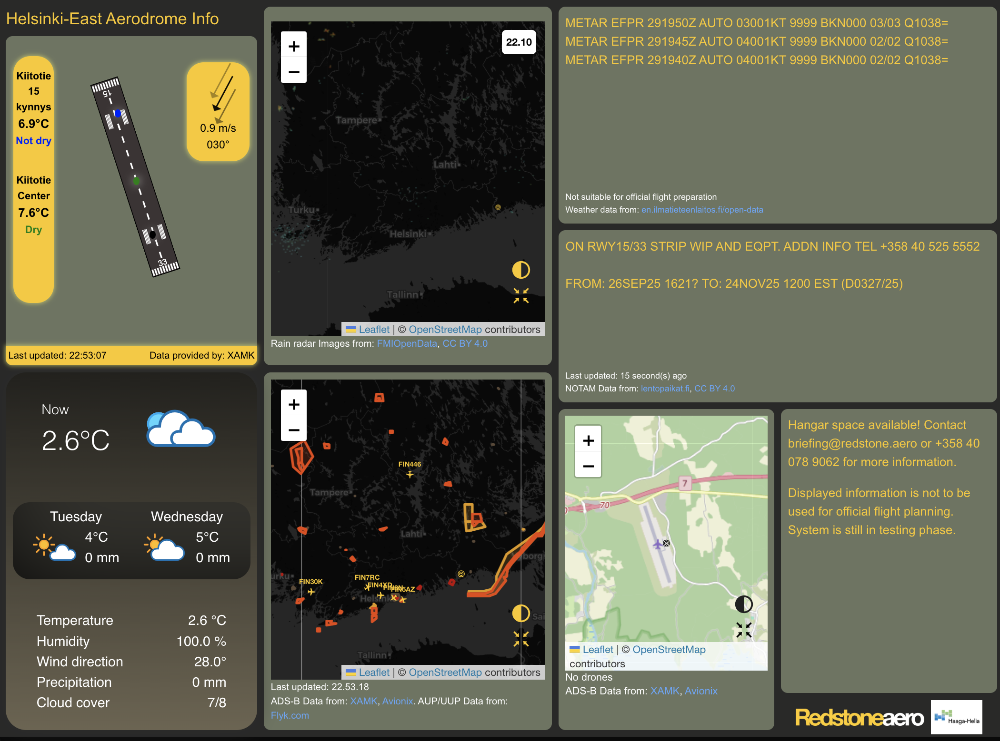

# Helsinki-East Aerodrome info screen

Infoscreen for Helsinki-East Aerodrome (EFPR)
This is a [Next.js](https://nextjs.org/) project bootstrapped with [`create-next-app`](https://github.com/vercel/next.js/tree/canary/packages/create-next-app).

This project is forked from https://github.com/EHA-Display-Terminal-Team/eha-infoscreen



## Getting Started

`yarn install` (only at first time)
`yarn dev`

Open [http://localhost:3000](http://localhost:3000) with your browser to see the result.

You can start editing the page by modifying `app/page.js`. The page auto-updates as you edit the file.

This project uses [`next/font`](https://nextjs.org/docs/basic-features/font-optimization) to automatically optimize and load Inter, a custom Google Font.

## Environment variables

### ADSB Data

Aircraft location data from aero-network.
ADS-B Data from: XAMK, Avionix. AUP/UUP Data from: Flyk.com

ADSB_APIKEY=  
ADSB_USERKEY=  

### Runway station observations

Runway temperature data by Vaisala.

RUNWAY_ID=
RUNWAY_SECRET=

### Firebase

Go to firebase console and from your project go to "Project settings" and create a web app to get these following env variables.

NEXT_PUBLIC_FIREBASE_APIKEY=
NEXT_PUBLIC_FIREBASE_AUTHDOMAIN=
NEXT_PUBLIC_FIREBASE_DATABASEURL=
NEXT_PUBLIC_FIREBASE_PROJECTID=
NEXT_PUBLIC_FIREBASE_STORAGEBUCKET=
NEXT_PUBLIC_FIREBASE_MESSAGINGSENDERID=
NEXT_PUBLIC_FIREBASE_APPID=

## Creating a new Firebase project

Create a new Firebase project from Firebase console. You should have Firebase CLI version 12.1.0 or later. You might have to install firebase-tools globally `npm install -g firebase-tools`.

Only at first time:
`firebase login`  
`firebase experiments:enable webframeworks` to make Next.js work with Firebase  
`firebase init` (select hosting and realtime database)

Hosting init:  
Select `Use an existing project`

```
=== Hosting Setup
? Detected an existing Next.js codebase in the current directory, should we use this? *Yes*
? In which region would you like to host server-side content, if applicable? *europe-west1 (Belgium)*
? Set up automatic builds and deploys with GitHub? *No*
```

## Deploying to Firebase

When deploying a new version to Firebase:  
`yarn fb-deploy`
